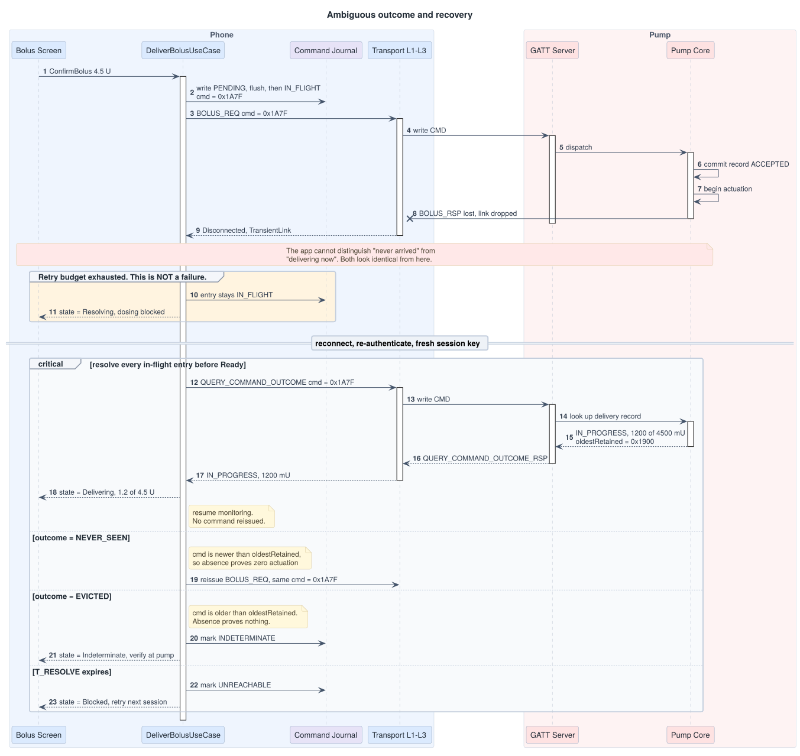
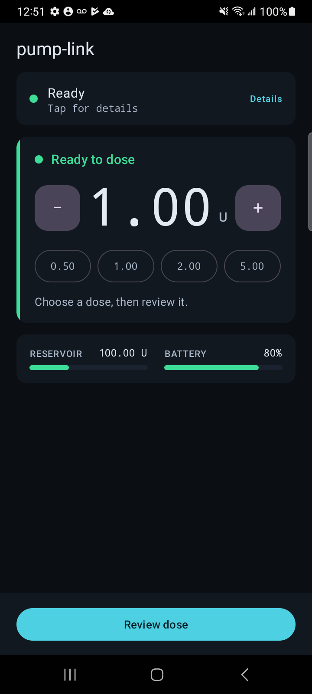
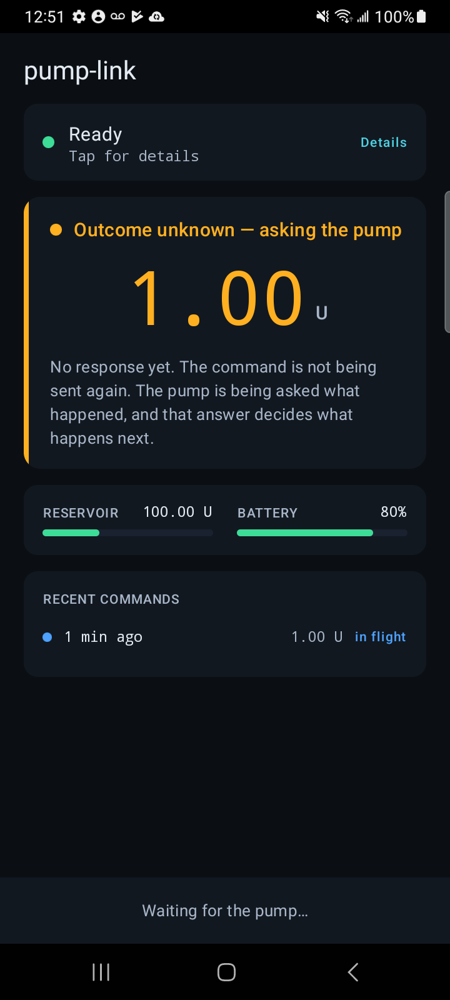
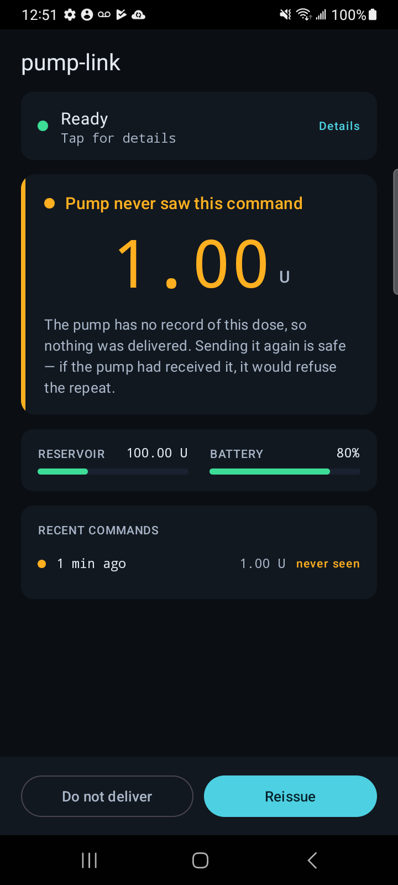
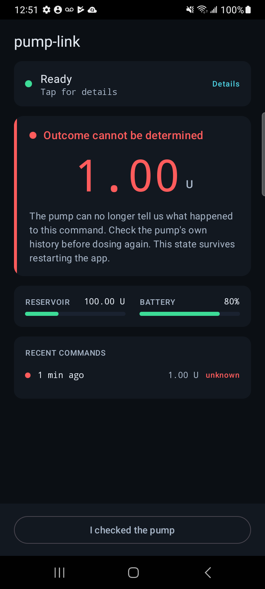

# pump-link

[](https://github.com/JBrannenMobileDev/pump-link/actions/workflows/build.yml)
[](https://github.com/JBrannenMobileDev/pump-link/actions/workflows/docs.yml)

A reference design for delivering a non-idempotent command to a medical device
over an unreliable BLE link. The concrete feature is a user initiated insulin
bolus. 

The interesting problem is not the bolus. It is that the transport fails
ambiguously, the command is not idempotent, and the pump's state can advance
while the phone is absent. Recovery is always **query-then-decide**. A delivery
command is never retried on an ambiguous response.

[Watch the 90-second recovery](https://github.com/JBrannenMobileDev/pump-link/releases/tag/v1.0)
— mid-command disconnect, then `QUERY_COMMAND_OUTCOME`. Never a second
`CommandId`. 

## The diagram this repository exists for

Retries exhausted is not failure. The outcome is unknown, so the controller
journals the original `CommandId`, queries the pump's delivery record, and
decides. The pump is the source of truth.

<picture>
  <source media="(prefers-color-scheme: dark)" srcset="docs/img/06-recovery-dark.svg">
  
</picture>

`Ready` is unreachable until every locally journaled in-flight command has
been reconciled. The connection state machine lives in
[docs/03-connection-state-machine.md](docs/03-connection-state-machine.md).

The picture is generated from [diagrams/](diagrams/). CI re-renders every
`.puml` and fails on a stale SVG, so the images in the docs cannot drift from
the sources that produce them.

## What the operator sees

These four states are the interesting ones. Screenshots come from the debug
gallery, driven by the same [`BolusScenarios`](presentation/src/main/kotlin/dev/pumplink/presentation/BolusScenarios.kt)
table the JVM totality test asserts over (`tools/capture-states.sh`).

| Entering | Resolving | Awaiting reissue | Indeterminate |
| --- | --- | --- | --- |
|  |  |  |  |

## What to read first

| Document | Question |
| --- | --- |
| [docs/00-overview.md](docs/00-overview.md) | Scope, sources, verification boundary |
| [docs/01-feature-flow.md](docs/01-feature-flow.md) | Every abort path |
| [docs/02-protocol.md](docs/02-protocol.md) | Wire format |
| [docs/03-connection-state-machine.md](docs/03-connection-state-machine.md) | Link lifecycle |
| [docs/06-sequence-diagrams.md](docs/06-sequence-diagrams.md) | Call flow, normally and during recovery |
| [docs/04-hazard-analysis.md](docs/04-hazard-analysis.md) | What can hurt someone |
| [docs/05-parity-contract.md](docs/05-parity-contract.md) | Android / iOS observable behavior |
| [docs/07-architecture.md](docs/07-architecture.md) | Why the modules are shaped this way |
| [docs/08-harness.md](docs/08-harness.md) | Mac-to-JVM socket (not the product protocol) |
| [docs/09-device-verification.md](docs/09-device-verification.md) | What remains when a radio is attached |
| [docs/10-demo-storyboard.md](docs/10-demo-storyboard.md) | What the 90-second recording shows |

## Layout

```
:protocol      framing, codec, session, connection state machine   (JVM)
:simulator     PumpCore, record store, fault injection, pump-host  (JVM)
:domain        entities, journal interface, use cases              (JVM)
:presentation  BolusUiState, intents, reduce, projection           (JVM)
:data          BLE central, fsync journal, foreground service      (Android)
:app           Compose shell                                       (Android)
mac/PumpPeripheral   CBPeripheralManager GATT host                 (Swift)
```

`:presentation` exists so detekt's sealed-`when` rule actually runs on the
reducer. AGP 9 does not create type-resolution tasks for Android modules.

## Build

```bash
export JAVA_HOME="/Applications/Android Studio.app/Contents/jbr/Contents/Home"
./gradlew :protocol:check :domain:check :presentation:check :simulator:check
./gradlew :app:assembleDebug
```

Twenty-three of twenty-six scenario-table rows run on the JVM in that first
command. SC-16 and SC-17 need a device (process lifecycle). SC-14 is partial
on the JVM (version mismatch only).

## Two-device demo

The Galaxy A32 5G is the **controller** (BLE central). The pump radio is a
macOS app. `PumpCore` stays on the JVM.

1. `./gradlew :simulator:run` — pump-host on `127.0.0.1:17341`
2. `mac/PumpPeripheral/scripts/bundle.sh && open mac/PumpPeripheral/build/PumpPeripheral.app`
   Keep the window in the foreground.
3. Install `app/build/outputs/apk/debug/app-debug.apk` on the A32, grant
   Bluetooth, deliver a bolus, then inject "Drop next RSP" or "Disconnect
   mid-command" and watch the app query rather than reissue.

Hardware verification procedure: [docs/09-device-verification.md](docs/09-device-verification.md).

## Verification boundary

Stated as a boundary rather than left implicit, because an unqualified claim
of "works" is the less honest option.

- **BLE, on hardware.** Controller verified against a real radio on a Samsung
  Galaxy A32 5G running **Android 13 (API 33)**. The pump peripheral is hosted
  on macOS via CoreBluetooth.
- **Foreground-service typing is declared, not exercised.** The app declares
  `foregroundServiceType="connectedDevice"`. The handset is API 33, so the
  Android 14 enforcement path is not observed.
- **Not verified on iOS as a controller.** The iOS central column of the
  parity contract is a specification of required behavior, not a record of
  observed behavior. The macOS peripheral does exercise several CoreBluetooth
  paths.

Full statement: [docs/00-overview.md](docs/00-overview.md#verification-boundary).

## License

[Apache License 2.0](LICENSE)
