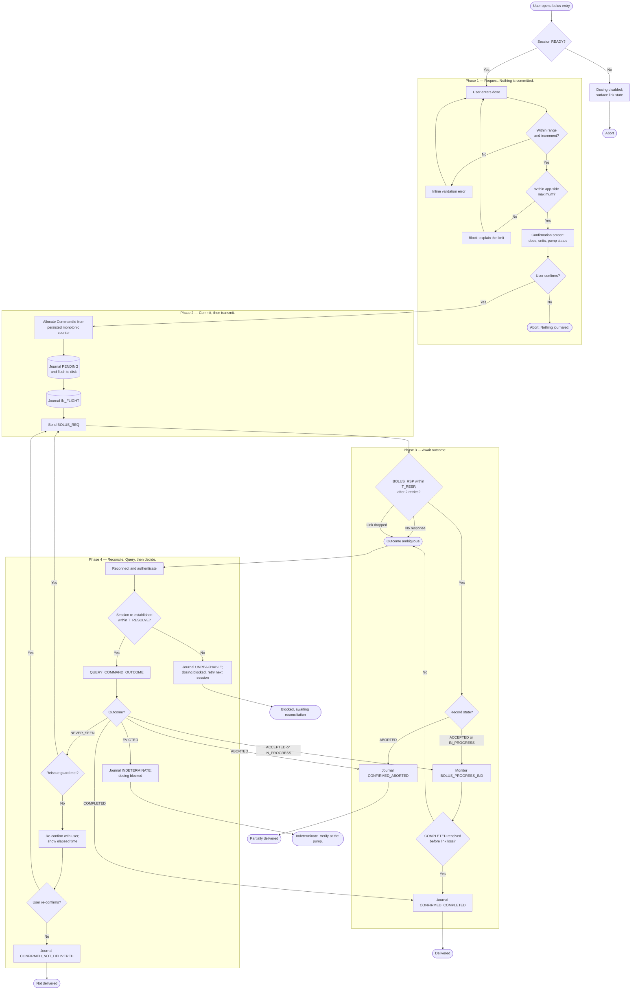
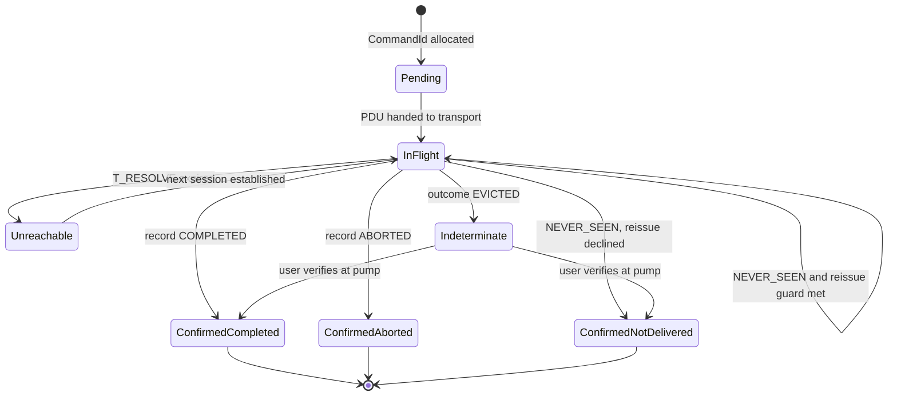

# 01 — Feature Flow: Deliver a Bolus

The feature, decomposed to every decision node and every abort path.

The flow is partitioned by **phase** rather than by actor. Actor partitions are
the conventional UML choice, but here the interesting structure is temporal: the
commit point in Phase 2 divides the flow into "nothing has happened yet" and
"something may have happened," and every hazard lives on one side of that line.
Ownership per node is given in the [decision table](#decision-table) instead.

## Activity diagram

## The commit point

`J2` is where the flow becomes irreversible, and it is placed before `T1`
deliberately.

Journaling before transmitting looks like unnecessary latency on the happy path.
It is the only thing that makes the ambiguous case recoverable. If the phone
transmits first and is killed by the OS before the write completes, the
`CommandId` for a dose that may be in progress no longer exists anywhere on the
phone, there is nothing to query, and the app has permanently lost the ability
to distinguish delivered from not delivered. The pump would hold the answer and
the app would have thrown away the question.

The pump makes the mirror-image commitment for the same reason: it commits the
delivery record before it actuates ([02-protocol.md](02-protocol.md#bolus_req-handling),
step 4 before step 5). Both sides write down what they are about to do before
they do it, so that absence of a record is evidence.

## Decision table

| Node | Guard | Owner | On true | On false |
| --- | --- | --- | --- | --- |
| `G0` | Connection state is `READY`, which implies reconciliation is complete | `:protocol` state machine, projected into `UiState` | Enable entry | Disable dosing, show link state |
| `G1` | `0 < dose ≤ 25 U` and dose is a multiple of the 0.05 U increment | `:domain` | Continue | Inline error, stay on entry |
| `G2` | Dose ≤ configured per-bolus maximum | `:domain` | Continue | Block with explanation |
| `G3` | Explicit user confirmation on a screen showing the dose | `:app` | Commit | Abort with nothing written |
| `G4` | `BOLUS_RSP` received within `T_RESP`, after at most 2 identical retries | `:protocol` L3 | Inspect record | **Ambiguous** — reconcile |
| `G5` | Record state in the response | `:domain` | Branch as tabulated | — |
| `G6` | `COMPLETED` observed before the link drops | `:domain` | Confirm | **Ambiguous** — reconcile |
| `G7` | Session re-established within `T_RESOLVE` | `:protocol` state machine | Query | Block, retry next session |
| `G8` | Outcome enum | `:domain` | Branch as tabulated | — |
| `G9` | See [reissue guard](#the-reissue-guard) | `:domain` | Reissue same `CommandId` | Ask the user again |
| `G10` | Explicit re-confirmation | `:app` | Reissue same `CommandId` | Record as not delivered |

`G9` and `G10` both re-enter at `T1`, which re-sends the original `CommandId`.
Neither path allocates a new one. (REQ-S-08)

## The reissue guard

`NEVER_SEEN` proves the dose did not happen, so reissuing is safe with respect to
double-dosing. It is not automatically safe with respect to *intent*: enough time
may have passed that the user has walked away, eaten, or dosed by another route,
and delivering insulin to an unattended phone screen is its own hazard.

Automatic reissue therefore requires **all** of:

- Less than 60 seconds elapsed since the user confirmed
- The bolus screen is still in the foreground
- No intervening user action
- This is the first reissue for this `CommandId`

Otherwise the user re-confirms explicitly, with the elapsed time shown so the
decision is informed.

The alternative designs, and why they were not taken. *Always auto-reissue*
converts a transient two-second link blip into silent delivery minutes later,
which is the intent hazard above. *Never auto-reissue* is safe but forces a
confirmation dialog after every momentary radio glitch; in a device used many
times a day, confirmation prompts that are usually spurious train users to
dismiss them, which degrades the confirmations that matter. The bounded guard
keeps automatic behavior inside the window where the user is demonstrably
present and attending.

Residual risk is recorded as H-07 in
[04-hazard-analysis.md](04-hazard-analysis.md).

## Terminal states

Every path ends in exactly one of these, and each is a distinct, persistent
`UiState` — not a transient message.

| Terminal state | Meaning | Dosing allowed after? |
| --- | --- | --- |
| Delivered | Pump-confirmed `COMPLETED` with a delivered volume | Yes |
| Partially delivered | Pump-confirmed `ABORTED`; delivered volume and reason known | Yes |
| Not delivered | Pump-confirmed `NEVER_SEEN`; user declined reissue | Yes |
| Blocked, awaiting reconciliation | Could not reach the pump to resolve an in-flight command | **No** |
| Indeterminate | Reconciled, but the record had been evicted | **No**, until the user confirms at the pump |

The last two block further dosing. That is the correct behavior and it is
enforced in the state machine rather than in the UI: the bolus operation is only
reachable from `READY`, and an unresolved journal entry prevents `READY`.
(REQ-S-06, invariant I-5)

None of the five is a toast, snackbar, or dialog that can be missed. An
indeterminate delivery state is a property of the system, so it is represented
as state — which is also what
[Google's UI events guidance](https://developer.android.com/topic/architecture/ui-layer/events)
recommends for the general case, for weaker reasons than apply here.

## Journal lifecycle

The app-side mirror of the pump's delivery record. Persisted, survives process
death, and is the input to reconciliation on every subsequent session.

`Unreachable` and `Indeterminate` differ in a way worth keeping distinct.
`Unreachable` means the question has not been asked yet and will be asked again
automatically. `Indeterminate` means the question was asked and the pump could
no longer answer it; no amount of retrying will change that, so resolution
requires a human reading the pump's own history. Collapsing the two into one
"error" state would cause the app to retry forever on a question that has no
remaining answer.

## Deliberately not in this diagram

- **Bonding and pairing.** Preconditions, owned by
  [03-connection-state-machine.md](03-connection-state-machine.md).
- **Occlusion, reservoir, and expiry checks.** The pump enforces these and may
  return `ABORTED`; the app mirrors the limits for early feedback but is not the
  enforcement point. Duplicating enforcement in the app would create two
  authorities for one safety limit.
- **Automated dosing.** Out of scope per [00-overview.md](00-overview.md#scope).
- **Retry and backoff mechanics.** L3 concern, specified in
  [02-protocol.md](02-protocol.md#timeouts-and-retry). Showing them here would
  put transport detail in a clinical flow and obscure the four decision points
  that actually matter.
