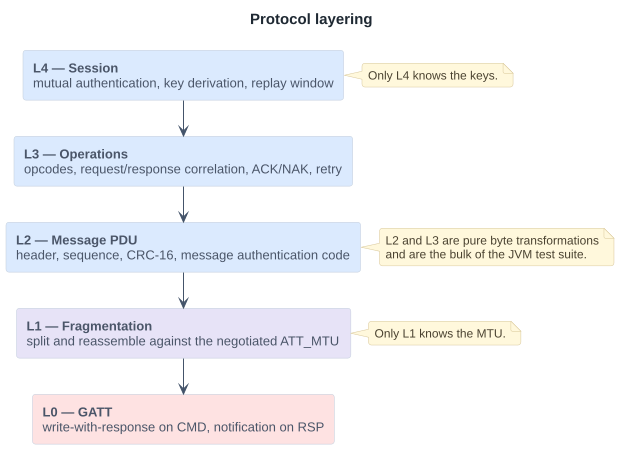

# 02 — Wire Protocol

Normative specification of what goes over the air. Code implements this
document; where the two disagree, this document is correct and the code is a
defect.

All multi-byte integers are **big-endian**. Bit 7 is the most significant bit of
a byte.

## Layering

GATT is an attribute store, not a transport. Treating it as one is how BLE
stacks acquire their worst bugs, so the layers are separated explicitly and each
one is independently testable.

<picture>
  <source media="(prefers-color-scheme: dark)" srcset="img/02-layers-dark.svg">
  
</picture>

Only L1 knows the MTU. Only L4 knows the keys. L2 and L3 are pure byte
transformations and are the bulk of the JVM test suite.

## L0 — GATT service

UUIDs were randomly generated for this project.

| Attribute | UUID | Properties | Direction |
| --- | --- | --- | --- |
| PumpLink Service | `6f1c0001-4e7a-4b16-9c3d-2f8a5d61b704` | — | — |
| `CMD` | `6f1c0002-4e7a-4b16-9c3d-2f8a5d61b704` | Write (with response), encrypted | Controller → Pump |
| `RSP` | `6f1c0003-4e7a-4b16-9c3d-2f8a5d61b704` | Notify, encrypted | Pump → Controller |
| `STATUS` | `6f1c0004-4e7a-4b16-9c3d-2f8a5d61b704` | Read, Notify, encrypted | Pump → Controller |

**Write-with-response, not write-without-response.** Write-without-response is
faster and is the wrong choice here: it gives the controller no flow control and
no local confirmation that the ATT layer accepted the octets. That confirmation
is not evidence of delivery — see [L3](#l3--operations) — but losing it removes a
diagnostic distinction the recovery logic uses.

`STATUS` is readable on an encrypted link without an application session. It
carries only the protocol version, the logical device identity, and a **record
epoch** counter that increments on every change to the delivery record store.
The epoch lets a reconnecting controller detect in one read that the pump's
state advanced while it was absent, before paying for a full session. Deliberate
tradeoff: this leaks a coarse activity signal to a bonded peer, accepted here
because the alternative is a full session establishment on every wake.

### Advertising and logical identity

A 128-bit service UUID consumes 16 of the 31 octets of advertising payload. The
service UUID therefore goes in the **scan response**, and the advertising
payload carries flags, a short local name, and manufacturer-specific data
containing the pump's **logical device identity** — a 16-byte value that is
stable across a disposable patch change and across both platforms.

This is not cosmetic. iOS never exposes a peripheral's Bluetooth address and
issues a per-app opaque `CBPeripheral` identifier; Android exposes an address
that may be randomized. Neither platform handle is a durable device identity, so
identity is defined at the protocol layer where both platforms can see the same
value. See [05-parity-contract.md](05-parity-contract.md).

## L1 — Fragmentation

A message PDU that exceeds one attribute write is split into fragments. Each
GATT write or notification carries exactly one fragment.

Usable payload per fragment:

```
fragment_payload_max = ATT_MTU - 3 (ATT opcode + handle) - 1 (fragment header)
```

At the specification minimum `ATT_MTU` of 23, that is **19 octets**. The
framing layer never assumes a value; the negotiated MTU is a runtime input, and
the test suite exercises both 23 and 517. (REQ-S-09)

### Fragment header — 1 octet

| Bits | Field | Meaning |
| --- | --- | --- |
| 7 | `FIRST` | First fragment of a message |
| 6 | `LAST` | Last fragment of a message |
| 5–4 | reserved | Transmit as 0, ignore on receive |
| 3–0 | `INDEX` | Fragment index within the message, modulo 16 |

A message that fits in one fragment sets both `FIRST` and `LAST` with
`INDEX = 0`.

**Receiver rules.** `FIRST` discards any partial buffer and starts a new one.
A fragment without `FIRST` when no buffer is open is discarded. `INDEX` must
equal the previous index plus one, modulo 16; any other value discards the
buffer and raises `NAK(REASSEMBLY_ERROR)`. `LAST` completes the message and
passes it to L2. A reassembly buffer is discarded on disconnection and on any
buffer exceeding the maximum message size of 512 octets.

## L2 — Message PDU

After reassembly:

```text
 0                   1                   2                   3
 0 1 2 3 4 5 6 7 8 9 0 1 2 3 4 5 6 7 8 9 0 1 2 3 4 5 6 7 8 9 0 1
+-+-+-+-+-+-+-+-+-+-+-+-+-+-+-+-+-+-+-+-+-+-+-+-+-+-+-+-+-+-+-+-+
|  Ver  | Flags |    Opcode     |      Seq      |    AckSeq     |
+-+-+-+-+-+-+-+-+-+-+-+-+-+-+-+-+-+-+-+-+-+-+-+-+-+-+-+-+-+-+-+-+
|                           CommandId                           |
+-+-+-+-+-+-+-+-+-+-+-+-+-+-+-+-+-+-+-+-+-+-+-+-+-+-+-+-+-+-+-+-+
|                                                               |
/                     Payload (0..n octets)                     /
|                                                               |
+-+-+-+-+-+-+-+-+-+-+-+-+-+-+-+-+-+-+-+-+-+-+-+-+-+-+-+-+-+-+-+-+
|                                                               |
+               MAC (8 octets, present iff AUTH)                +
|                                                               |
+-+-+-+-+-+-+-+-+-+-+-+-+-+-+-+-+-+-+-+-+-+-+-+-+-+-+-+-+-+-+-+-+
|            CRC-16             |
+-+-+-+-+-+-+-+-+-+-+-+-+-+-+-+-+
```

Normative field table:

| Offset | Size | Field | Notes |
| --- | --- | --- | --- |
| 0 | 1 | `Version` (bits 7–4), `Flags` (bits 3–0) | Version is `0x1` |
| 1 | 1 | `Opcode` | See [opcode table](#opcodes) |
| 2 | 1 | `Seq` | Monotonic per direction within a session |
| 3 | 1 | `AckSeq` | `Seq` of the message being responded to; `0xFF` if none |
| 4 | 4 | `CommandId` | Client-generated; `0x00000000` for non-command messages |
| 8 | n | `Payload` | Opcode-specific, may be empty |
| 8+n | 8 | `MAC` | Present if and only if `Flags.AUTH` |
| 8+n(+8) | 2 | `CRC-16` | Covers every preceding octet of the PDU |

Header is 8 octets. Smallest unauthenticated PDU is 10 octets; smallest
authenticated PDU is 18 octets, which fits in a single fragment even at the
minimum MTU.

### Flags

| Bit | Name | Meaning |
| --- | --- | --- |
| 3 | `AUTH` | `MAC` field present; PDU is covered by the session key |
| 2 | `ACK_REQ` | Sender requires an L3 response or `ACK` |
| 1 | `RESP` | This PDU is a response; `AckSeq` is meaningful |
| 0 | reserved | Transmit as 0 |

### No explicit length field

The reassembled fragment sequence already determines the PDU length exactly, and
the `AUTH` flag determines whether the trailing 8 octets before the CRC are a
MAC. An additional length field would be a second, independent source of truth
for the same quantity — which is a parser vulnerability, not defense in depth,
because it creates a disagreement case that has to be adjudicated. The CRC
detects truncation.

Consequence to be aware of: this design does not survive being moved onto a
byte-stream transport unchanged. If a future transport does not preserve message
boundaries, L1 is the layer that changes, and a length prefix belongs there
rather than in L2.

### CRC-16

CRC-16/CCITT-FALSE: polynomial `0x1021`, initial value `0xFFFF`, no input or
output reflection, no final XOR. Check value for the ASCII string `123456789` is
`0x29B1`, which is the unit test vector.

The CRC guards against corruption, not against tampering. Tamper resistance is
the `MAC`.

### Sequence numbers and duplicate suppression

`Seq` is an 8-bit counter, independent per direction, starting at `0` on session
establishment and incrementing by one per transmitted PDU.

A receiver retains the last accepted `Seq`. An incoming PDU is accepted if
`(Seq - lastAccepted) mod 256` lies in `1..127`, and is otherwise rejected as a
duplicate or replay with `NAK(SEQ_OUT_OF_WINDOW)`. A PDU whose `Seq` exactly
equals `lastAccepted` and whose content is byte-identical is treated as a
retransmission: the cached response is re-sent and the operation is **not**
re-executed.

## L3 — Operations

### Opcodes

| Opcode | Name | Payload |
| --- | --- | --- |
| `0x01` | `AUTH_CHALLENGE_REQ` | `controllerId` (16), `nonceC` (16) |
| `0x02` | `AUTH_CHALLENGE_RSP` | `pumpId` (16), `nonceP` (16) |
| `0x03` | `AUTH_VERIFY_REQ` | `mac` (16) |
| `0x04` | `AUTH_VERIFY_RSP` | `mac` (16) |
| `0x05` | `SESSION_END` | — |
| `0x10` | `GET_STATUS_REQ` | — |
| `0x11` | `GET_STATUS_RSP` | `reservoirMilliunits` (2), `batteryPercent` (1), `deliveryActive` (1), `recordEpoch` (4), `storeInstanceId` (8) |
| `0x20` | `BOLUS_REQ` | `requestedMilliunits` (2), `maxDurationSeconds` (2) |
| `0x21` | `BOLUS_RSP` | delivery record (see below) |
| `0x22` | `BOLUS_CANCEL_REQ` | — (targets `CommandId`) |
| `0x23` | `BOLUS_CANCEL_RSP` | delivery record |
| `0x24` | `BOLUS_PROGRESS_IND` | `deliveredMilliunits` (2) — unsolicited |
| `0x30` | `QUERY_COMMAND_OUTCOME_REQ` | — (targets `CommandId`) |
| `0x31` | `QUERY_COMMAND_OUTCOME_RSP` | `outcome` (1), delivery record, `oldestRetainedCommandId` (4), `storeInstanceId` (8) |
| `0x32` | `GET_HISTORY_REQ` | `sinceCommandId` (4) |
| `0x33` | `GET_HISTORY_RSP` | `count` (1), delivery records |
| `0x7E` | `ACK` | — |
| `0x7F` | `NAK` | `reason` (1) |

### NAK reasons

`0x01 CRC_FAIL`, `0x02 BAD_MAC`, `0x03 SEQ_OUT_OF_WINDOW`,
`0x04 REASSEMBLY_ERROR`, `0x05 UNKNOWN_OPCODE`, `0x06 NOT_AUTHENTICATED`,
`0x07 BUSY`, `0x08 MALFORMED_PAYLOAD`, `0x09 UNSUPPORTED_VERSION`.

### Timeouts and retry

| Parameter | Value | Applies to |
| --- | --- | --- |
| `T_RESP` | 2000 ms | Request sent → response or `ACK` received |
| `T_FRAG` | 500 ms | Between consecutive fragments of one message |
| `T_AUTH` | 5000 ms | Whole session establishment exchange |
| `T_RESOLVE` | 10000 ms | Whole reconciliation phase |
| Retry attempts | 2 | Per request |
| Backoff | 500 ms, 1500 ms | Between attempts |

**A retry re-sends a byte-identical PDU** — same `CommandId`, same `Seq`, same
`MAC`. This is what makes retry safe at the transport layer: a retried
`BOLUS_REQ` is indistinguishable from a duplicate and is suppressed by the rules
above. Constructing a fresh PDU for a retry would defeat both the sequence
window and the delivery record, and is prohibited.

Exhausting retries does **not** mean the command failed. It means the outcome is
unknown, which is a different state with a different handler. (REQ-S-07)

## L4 — Session

A pairing secret `K_p` is established during initial pairing, which is out of
scope for this document. Session establishment assumes `K_p` is present on both
sides.

1. Controller → Pump: `AUTH_CHALLENGE_REQ { controllerId, nonceC }`
2. Pump → Controller: `AUTH_CHALLENGE_RSP { pumpId, nonceP }`
3. Both derive
   `K_s = HKDF-SHA256(ikm = K_p, salt = nonceC ‖ nonceP, info = "pump-link/v1/session", L = 32)`
4. Controller → Pump: `AUTH_VERIFY_REQ { HMAC-SHA256(K_s, "controller" ‖ nonceC ‖ nonceP)[0:16] }`
5. Pump → Controller: `AUTH_VERIFY_RSP { HMAC-SHA256(K_s, "pump" ‖ nonceP ‖ nonceC)[0:16] }`

Nonces are 16 octets from a cryptographically secure random source and are never
reused. After step 5 every PDU sets `Flags.AUTH` and carries
`MAC = HMAC-SHA256(K_s, pdu[0 .. 8+n))[0:8]` — that is, the MAC covers the
header including `Seq` and `CommandId`, and the payload.

Because `Seq` is inside the MAC and `K_s` is derived from fresh nonces, a PDU
captured in one session cannot be replayed into another, and cannot be reordered
within one.

**Reviewed limitations.** The MAC is truncated to 8 octets to keep an
authenticated PDU inside one minimum-MTU fragment; that is a bandwidth-versus-
forgery-resistance tradeoff which a real design would justify quantitatively or
reject. There is no forward secrecy and no key rotation. `K_p` provisioning,
storage, and revocation are unspecified. This scheme demonstrates where
authentication attaches to a device protocol; it is not proposed as a production
design, and [00-overview.md](00-overview.md#security-posture) says so plainly.

## The delivery record

This is the part of the protocol that carries the safety argument.

The pump maintains a persistent, ordered store of delivery records. The store as
a whole carries two identifiers, distinct from the records in it:

| Field | Size | Notes |
| --- | --- | --- |
| `storeInstanceId` | 8 | Random; regenerated **only** when the store is created or cleared |
| `recordEpoch` | 4 | Increments on every change to the store |

`recordEpoch` answers "has anything happened since I last looked," which is a
cheap change-detection question. `storeInstanceId` answers "is this the same
store I was talking to," which is a different question and the one that
[`NEVER_SEEN`](#query_command_outcome-and-what-unknown-actually-means) depends
on. Conflating them is a mistake worth naming, because an epoch is the obvious
thing to reach for and it cannot carry the safety argument: it is *expected* to
differ on every reconnect, so a controller has no way to tell twelve intervening
doses from a wiped store.

Each record holds:

| Field | Size | Notes |
| --- | --- | --- |
| `commandId` | 4 | The controller-generated identifier |
| `state` | 1 | `ACCEPTED`, `IN_PROGRESS`, `COMPLETED`, `ABORTED` |
| `requestedMilliunits` | 2 | As requested |
| `deliveredMilliunits` | 2 | Actually actuated, updated during delivery |
| `abortReason` | 1 | Valid when `state = ABORTED` |
| `startedAt`, `endedAt` | 4 each | Pump uptime ticks |

### `BOLUS_REQ` handling

1. Reject unless authenticated, `Seq` in window, CRC valid.
2. Look up `CommandId` in the record store.
   **If present, return the existing record as `BOLUS_RSP` and stop. Do not
   deliver.** (REQ-S-04)
3. Validate the request against pump safety limits — maximum single bolus,
   maximum delivery over a rolling window, reservoir volume, occlusion state.
   On failure, commit an `ABORTED` record and return it.
4. **Commit an `ACCEPTED` record to non-volatile storage.** (REQ-S-03)
5. Begin actuation; transition the record to `IN_PROGRESS`.
6. On completion, update the record to `COMPLETED` with `deliveredMilliunits`.

Step 4 strictly precedes step 5. That ordering is the entire basis of the
recovery scheme, and it is the first thing to check in any implementation
review.

### `QUERY_COMMAND_OUTCOME` and what `UNKNOWN` actually means

| Outcome | Meaning | Controller action |
| --- | --- | --- |
| `NEVER_SEEN` | No record, `commandId` is newer than `oldestRetainedCommandId`, **and** `storeInstanceId` equals the one recorded when the command was sent | Provably not actuated. Safe to reissue with the same `CommandId`. |
| `ACCEPTED` | Committed, actuation not yet started | Await progress; do not reissue. |
| `IN_PROGRESS` | Actuating now | Await completion; do not reissue. |
| `COMPLETED` | Finished | Record `deliveredMilliunits` as the truth. |
| `ABORTED` | Stopped before completion | `deliveredMilliunits` is the truth; surface the reason. |
| `EVICTED` | No record, but `commandId` is older than `oldestRetainedCommandId` | **Indeterminate.** Not safe to reissue. Enter the indeterminate state per REQ-S-07. |
| `STORE_REPLACED` | No record, and `storeInstanceId` differs from the one recorded at send time | **Indeterminate.** Not safe to reissue. Enter the indeterminate state per REQ-S-07. |

Three of these outcomes mean "I have no record." Separating them is the point.

"No record found" only proves "no insulin was delivered" while the record for
that command *would still be retained if it existed*. That premise fails in two
independent ways, and a design that returns a single undifferentiated `UNKNOWN`
will confidently reissue a dose that already happened — the exact double-dose
the scheme exists to prevent, reintroduced by an implementation detail of the
storage layer.

**The store is finite.** Once it wraps, absence stops being evidence for old
identifiers. So the pump reports `oldestRetainedCommandId` alongside every
outcome, and absence is read as "never happened" only inside the retention
window. Outside it, `EVICTED`.

**The store can be replaced.** A factory reset, a firmware update that migrates
storage, or recovery from a corrupted store all produce a pump whose record
store is empty and whose `oldestRetainedCommandId` has restarted low. Every
outstanding `CommandId` then compares as "inside the retention window" and the
window test alone reports `NEVER_SEEN` — for doses the previous store may well
have delivered. The window test is a comparison against a watermark, and a reset
moves the watermark backwards, so the comparison silently changes meaning.

`storeInstanceId` closes that. The controller records it on the journal entry
when the command is sent, and re-checks it at query time. If the store is not
the same store, absence proves nothing about actuation, so the outcome is
`STORE_REPLACED` and resolution needs a human at the pump, exactly as with
`EVICTED`. The two share a controller action but not a cause, and are kept
distinct so the journal says which one happened.

This is the weaker sibling of the eviction argument and is easier to miss,
because eviction is visible in the data structure while a reset is visible only
in its absence.

**Retention.** Controllers allocate `CommandId` monotonically from a persisted
counter, which makes the comparison well-defined. The store retains a minimum of
512 records. `CommandId` is 32 bits; wraparound is not reachable in device
lifetime at any plausible dosing rate, and comparisons are unsigned with no
wrap handling — an assumption recorded here so that it is falsifiable rather
than buried.

**Out of scope.** Replacing the pump hardware and pairing to a new one is a
clinical workflow, not a protocol recovery path. The new pump is a different
device with a different identity, and any command outstanding against the old
one is resolved against the old one or not at all.

## Invariants

Stated so they can be asserted in tests rather than assumed in review.

- **I-1.** No actuation occurs for a `CommandId` without a committed record for
  that `CommandId` existing first.
- **I-2.** For any `CommandId`, total actuated volume across all time is at most
  `requestedMilliunits` of its single record.
- **I-3.** A `NEVER_SEEN` outcome implies zero actuated volume for that
  `CommandId`. This holds only because `NEVER_SEEN` requires both an unbroken
  `storeInstanceId` and an in-window `commandId`; drop either condition and the
  invariant becomes an assumption.
- **I-4.** The controller's rendered delivery state is a function of pump-confirmed
  records only, never of a GATT write callback. (REQ-S-05)
- **I-5.** No `BOLUS_REQ` is transmitted on a session whose reconciliation phase
  has not completed. (REQ-S-06)

I-5 is enforced structurally rather than by convention: the connection state
machine in [03-connection-state-machine.md](03-connection-state-machine.md) has
a `RECONCILING` state between `AUTHENTICATED` and `READY`, and the operation
that sends a bolus is only reachable from `READY`.
