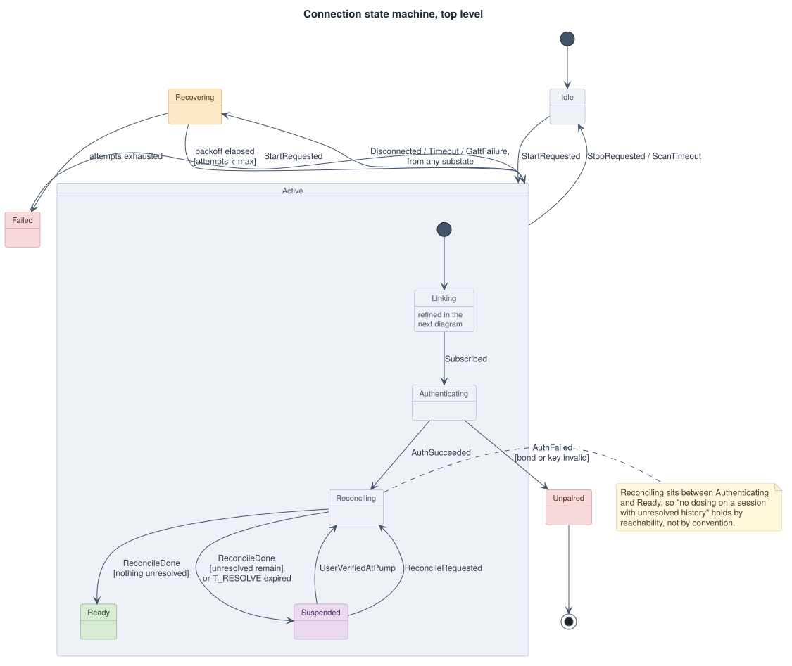
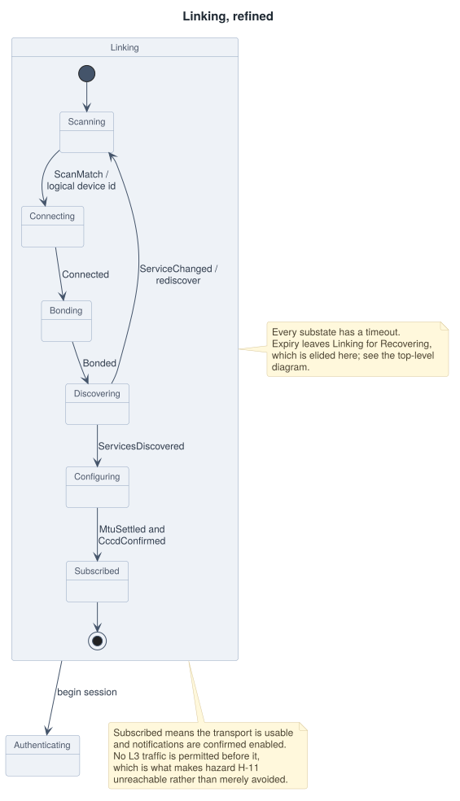

# 03 — Connection State Machine

Owns the link lifecycle from cold start to a session that is permitted to dose.
Lives in `:protocol` as pure Kotlin with no Android imports, and is a **pure
function**:

```kotlin
fun reduce(state: LinkState, event: LinkEvent): Transition
data class Transition(val state: LinkState, val effects: List<LinkEffect>)
```

Effects are returned as data and executed by the caller. Nothing inside the
reducer performs I/O, starts a coroutine, or reads a clock — timeouts arrive as
events. That is what allows every transition in this document, including every
timeout and every error class, to be tested on the JVM in milliseconds with no
radio and no device attached.

## Diagram

The machine is drawn at two levels. At the top level, the six states that get a
link up are collapsed into the composite state `Active.Linking`, and a single
transition off the `Active` boundary carries the disconnection and timeout cases
that apply to every substate. Drawing those as eleven separate edges is
technically equivalent and considerably harder to read.

<picture>
  <source media="(prefers-color-scheme: dark)" srcset="img/03-connection-state-dark.svg">
  
</picture>

`Linking` refined:

<picture>
  <source media="(prefers-color-scheme: dark)" srcset="img/03-linking-substates-dark.svg">
  
</picture>

The implementation is one flat `when (state, event)` reducer over the leaf
states listed below. The composite is a presentation device for the diagram, not
a nested state machine in the code — hierarchical states would buy nothing here
except a second dispatch mechanism to get wrong.

## `Reconciling` is the point of the diagram

Everything else here is a conventional BLE lifecycle. The load-bearing detail is
that `Reconciling` sits **between** `Authenticating` and `Ready`, and that the
bolus operation is reachable only from `Ready`.

This makes invariant I-5 — no delivery command on a session with unresolved
in-flight history — a property of the state machine rather than a rule someone
has to remember. There is no ordering of calls that sends a bolus before
reconciliation, because the function that sends a bolus takes a `Ready` state as
a parameter and no other state can be widened to it.

`Suspended` is the case where reconciliation ran and could not resolve
everything. The link is healthy and status is readable, but dosing is refused.
Distinguishing it from `Recovering` matters: `Recovering` is "we cannot talk to
the pump," `Suspended` is "we are talking to the pump and it told us something we
must not act through."

## States

| State | Meaning | Dosing |
| --- | --- | --- |
| `Idle` | No link, none wanted | No |
| `Scanning` | Advertising filter active on the service UUID | No |
| `Connecting` | GATT connect issued | No |
| `Bonding` | Waiting for bond, or confirming an existing bond | No |
| `Discovering` | Service and characteristic discovery | No |
| `Configuring` | MTU settled and notifications enabled on `RSP` | No |
| `Subscribed` | Transport usable; no application session yet | No |
| `Authenticating` | Challenge/response in progress | No |
| `Reconciling` | Resolving every journaled in-flight command | No |
| `Ready` | Session established, nothing unresolved | **Yes** |
| `Suspended` | Session established, something unresolved | No |
| `Recovering` | Backing off before another attempt | No |
| `Failed` | Attempts exhausted; awaiting user action | No |
| `Unpaired` | Bond or pairing secret invalid; re-pairing required | No |

## Events

| Event | Source |
| --- | --- |
| `StartRequested`, `StopRequested` | Application |
| `ScanMatch(logicalDeviceId)` | Scanner |
| `ScanTimeout` | Timer |
| `Connected`, `ConnectFailed(code)` | Platform GATT |
| `Disconnected(code)` | Platform GATT |
| `Bonded`, `BondFailed`, `BondLost` | Platform bonding |
| `ServicesDiscovered`, `DiscoveryFailed(code)` | Platform GATT |
| `ServiceChanged` | Peripheral indication |
| `MtuSettled(mtu)` | Platform GATT |
| `CccdConfirmed` | Platform GATT |
| `AuthSucceeded`, `AuthFailed(reason)` | `:protocol` L4 |
| `ReconcileDone(unresolvedCount)` | `:domain` |
| `UserVerifiedAtPump` | Application |
| `Timeout(state)` | Timer |

`ScanMatch` carries the **logical device identity** from the advertisement, not
a platform handle. Matching on a MAC address would work on Android and be
impossible on iOS; see [02-protocol.md](02-protocol.md#advertising-and-logical-identity).

## Guards

| Transition | Guard |
| --- | --- |
| `Scanning → Connecting` | Advertised logical device identity equals the paired one |
| `Reconciling → Ready` | `unresolvedCount == 0` |
| `Reconciling → Suspended` | `unresolvedCount > 0` |
| `Recovering → Scanning` | `attempts < maxAttempts` and backoff elapsed |
| `Recovering → Failed` | `attempts >= maxAttempts` |
| `Authenticating → Unpaired` | Failure reason is bond loss or key mismatch, not timeout |

## Timeouts

| State | Timeout | On expiry |
| --- | --- | --- |
| `Scanning` | 30 s | `Idle` |
| `Connecting` | 10 s | `Recovering` |
| `Bonding` | 30 s | `Recovering` |
| `Discovering` | 10 s | `Recovering` |
| `Configuring` | 5 s | `Recovering` |
| `Authenticating` | 5 s (`T_AUTH`) | `Recovering` |
| `Reconciling` | 10 s (`T_RESOLVE`) | `Suspended` |

`Reconciling` expiring goes to `Suspended`, not `Recovering`. The link may be
fine; what is not fine is proceeding. Sending it to `Recovering` would drop a
working connection and retry into the same wall.

## Error classes

Retry policy is defined here, once, over abstract classes. Platform error codes
are mapped into these classes at the platform boundary, never handled
individually in the state machine. This is the mechanism that keeps Android and
iOS retry behavior identical despite completely different error surfaces — see
[05-parity-contract.md](05-parity-contract.md).

| Class | Meaning | Policy |
| --- | --- | --- |
| `TransientLink` | Supervision timeout, out of range, failed establishment | Backoff and retry; do not surface until attempts are exhausted |
| `PeerInitiated` | Pump deliberately closed the connection | Longer backoff; expected during a patch change; do not surface as an error |
| `StackFault` | Host stack failure, resource exhaustion, unexplained | Close and release the GATT client before retrying; harder backoff; invalidate cached services after repeated occurrences |
| `CacheStale` | Discovered services disagree with the advertised protocol version, or `ServiceChanged` was indicated | Rediscover; do not count against the retry budget |
| `AuthFailure` | Bond lost, or session MAC verification failed | Do not retry. `Unpaired`, and surface to the user |
| `ProtocolFault` | CRC failure, reassembly failure, sequence outside window | Reset the session; keep the link; do not reconnect |
| `Unrecoverable` | Retry budget exhausted | `Failed`, surface to the user |

Backoff is 1 s, 2 s, 4 s, 8 s, 16 s, capped at 30 s, with ±20 % jitter, reset on
reaching `Ready`. Maximum 8 attempts before `Failed`.

`ProtocolFault` deliberately does **not** reconnect. A CRC or sequence failure
means the two sides disagree about session state, and tearing down a healthy
radio link to fix a software disagreement is both slower and less likely to work
than resetting the session over the link that is already up.

## What this state machine is not

It is not `UiState`, and the two are not merged.

`UiState` is a projection of this state plus the journal, the pump's last known
status, and whatever the user is currently typing. It has states this machine
does not, such as "user is entering a dose," and it collapses states this
machine distinguishes — `Connecting`, `Bonding`, `Discovering`, and `Configuring`
are all one spinner.

Conflating them is the standard BLE application mistake. It produces a UI state
enum that grows a case every time the transport learns a new failure mode, and a
transport that cannot be tested without a UI. The projection is a pure function
in `:domain`, tested by feeding it link states and asserting the rendered result;
see [07-architecture.md](07-architecture.md).
