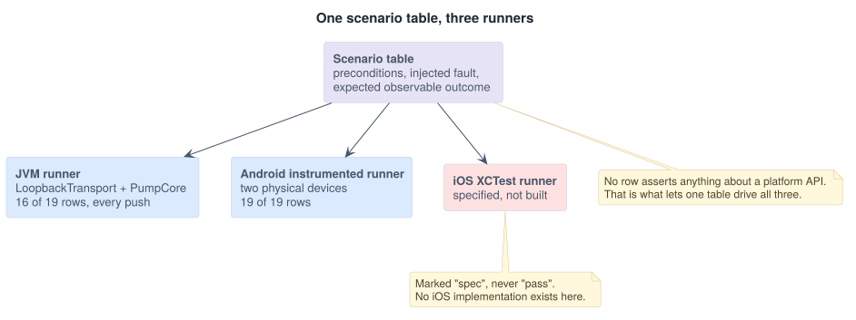

# 05 — Android / iOS Parity Contract

## The problem this document exists to solve

Two teams implement the same feature against the same pump. Both read the same
product requirements. Both ship. The apps behave differently, and the difference
is discovered in the field, because nothing anywhere stated the behavior
precisely enough to disagree with.

The divergences do not come from the teams disagreeing. They come from the
platforms disagreeing about things the product requirements never mentioned —
whether the MTU must be requested, whether enabling notifications is one call or
two, whether a device identity survives a hardware swap. Each platform's SDK has
an obvious, idiomatic way to do the thing, and the two obvious ways produce
different observable behavior at the edges.

So this document does two things. It specifies the required behavior once, in
platform-neutral terms. Then it enumerates the specific places where the
idiomatic implementation on each platform will silently diverge from that
specification, and states what each platform must do instead.

> **Status of the iOS column.** The Android behavior in this document was
> observed on hardware. The iOS behavior is derived from Apple's published
> documentation and is a **specification of required behavior, not a record of
> observed behavior.** Rows that have not been executed on iOS are marked. This
> distinction is maintained throughout rather than blurred.

## Part 1 — Observable behavior, specified once

Written so that a conforming implementation can be recognized without reference
to any platform API. These are the assertions the scenario table makes.

| ID | Required observable behavior |
| --- | --- |
| OB-01 | The controller identifies the pump by the logical device identity carried in its advertisement, and reconnects to it after any change of platform-level handle. |
| OB-02 | No application-layer message is transmitted before notifications on `RSP` are confirmed enabled. |
| OB-03 | The framing layer fragments against the actual negotiated MTU and never against an assumed one. |
| OB-04 | Session establishment occurs after the link is encrypted and before any operational command. |
| OB-05 | A delivery command is never transmitted on a session with unresolved journaled commands. |
| OB-06 | The user-visible delivery state changes only in response to a pump-confirmed record. |
| OB-07 | An ambiguous outcome produces the indeterminate state, and dosing is blocked until it resolves. |
| OB-08 | Retries of a delivery command are byte-identical and reuse the original `CommandId`. |
| OB-09 | Connection retry timing follows the same backoff schedule and the same maximum attempt count. |
| OB-10 | A given class of transport failure produces the same user-visible state and the same retry behavior. |
| OB-11 | An in-flight command survives the app being backgrounded, and its outcome is resolved on return. |
| OB-12 | A service layout that disagrees with the advertised protocol version is rediscovered before use. |
| OB-13 | The indeterminate state survives process death and is present on next launch. |

## Part 2 — Where the platforms diverge

### D-01 — Device identity

| | Android | iOS |
| --- | --- | --- |
| What you get | `BluetoothDevice.getAddress()`. The identity address once bonded; a resolvable random address before that. | `CBPeripheral.identifier`, an opaque `UUID` scoped to the app and device pair. The hardware address is never exposed. |
| Idiomatic mistake | Persist the MAC and reconnect by it. | Persist the `CBPeripheral.identifier` and reconnect by it. |

Neither handle is a durable device identity, and the Android one does not exist
on iOS at all, so an implementation built on it cannot be specified in a way both
platforms can satisfy.

This is sharper for a patch pump than for a generic peripheral. The published
Mint feature list includes that no phone is required during a patch change, which
means the phone can be absent across a hardware event and must re-establish
afterwards without user intervention.

**Contract.** Identity is defined at the protocol layer. The pump advertises a
16-byte logical device identity in manufacturer-specific data
([02-protocol.md](02-protocol.md#advertising-and-logical-identity)). Both
platforms scan filtered on the service UUID, read the logical identity from the
advertisement, and match on it. Platform handles are treated as caches that may
be invalidated at any time, never as identity. (OB-01)

### D-02 — MTU negotiation

| | Android | iOS |
| --- | --- | --- |
| Mechanism | `requestMtu()` must be called explicitly. Without it the MTU stays at the default 23. | Negotiated automatically during connection. There is no API to request one. |
| Reading the usable size | `onMtuChanged` callback | `maximumWriteValueLength(for:)` |

The failure this produces is asymmetric and therefore easy to miss: iOS quietly
gets a large MTU, Android quietly gets 23, and a framing layer that assumes
anything works on one platform and truncates on the other. Testing only on iOS
finds nothing.

**Contract.** The framing layer takes the MTU as a runtime input with no default
and no assumption. Android requests an MTU and waits for the callback before
leaving `Configuring`. iOS reads the negotiated value. Both run the scenario
table at the specification minimum of 23. (OB-03)

### D-03 — Notification enablement

| | Android | iOS |
| --- | --- | --- |
| Mechanism | Two steps: `setCharacteristicNotification()` locally, then write `ENABLE_NOTIFICATION_VALUE` to the CCCD descriptor `0x2902` remotely. | One call: `setNotifyValue(true, for:)`, which writes the CCCD internally. |
| Completion signal | `onDescriptorWrite` | `peripheral(_:didUpdateNotificationStateFor:error:)` |

On Android it is entirely possible to complete the local step, skip or not await
the descriptor write, and start sending. The peripheral has no subscriber, the
first responses are dropped, and the app enters reconciliation on the very first
command. On iOS the same code has no way to express the mistake.

This is hazard H-11 and it is the cleanest example of the general pattern: a
platform where an incorrect ordering is expressible, paired with one where it is
not.

**Contract.** `Subscribed` is not entered until the enablement completion
callback has fired on either platform, and L3 refuses to transmit before
`Subscribed`. Enforced by the state machine, not by ordering discipline. (OB-02)

### D-04 — Bonding and pairing order

| | Android | iOS |
| --- | --- | --- |
| Mechanism | `createBond()` explicitly, or implicitly on first access to an encrypted attribute. System dialog. `ACTION_BOND_STATE_CHANGED` broadcast. | No public pairing API. Pairing is triggered implicitly by accessing a characteristic that requires encryption. System dialog. |
| Observability | Bond state is directly queryable and observable | Inferred from the success or failure of the encrypted access |

The consequence is that the *position* of link-layer encryption in the connection
sequence differs. On Android it can be forced early and awaited. On iOS it
happens as a side effect of the first encrypted read or write, which means the
application-layer authentication exchange is what triggers it.

**Contract.** All three characteristics require encryption, so pairing is
triggered on both platforms by the first access regardless of which mechanism got
there. `Authenticating` is not entered until the link is encrypted; on Android by
awaiting the bond state, on iOS by treating the first successful encrypted
operation as the signal. Application-layer session establishment always follows
link-layer encryption and never substitutes for it. (OB-04)

### D-05 — Service caching

| | Android | iOS |
| --- | --- | --- |
| Behavior | Discovered services are cached per bonded device and reused aggressively. A firmware change can be served the old layout. | Handles `Service Changed` and reports through `peripheral(_:didModifyServices:)`. |
| Escape hatch | `BluetoothGatt.refresh()` is not public API. There is no supported programmatic cache invalidation. | Not needed in the same way. |

Android's lack of a supported invalidation path is the important part: the
mitigation cannot be "clear the cache," because there is no supported way to do
that. It has to be detection plus a strategy that works without clearing.

**Contract.** Protocol version appears in `STATUS` and in every PDU. A mismatch
between the discovered layout and the advertised version raises the `CacheStale`
error class, which forces rediscovery and, failing that, surfaces a state
instructing the user to forget and re-pair the device. iOS additionally acts on
`didModifyServices`. Neither platform proceeds on a layout it cannot confirm.
(OB-12, hazard H-05)

### D-06 — Error surfaces

| | Android | iOS |
| --- | --- | --- |
| Surface | Integer status codes on every GATT callback: `8` supervision timeout, `19` peer terminated, `22` local host terminated, `62` failed to establish, `34` LMP timeout, `133` generic and heavily overloaded | `CBError` and `CBATTError` domains with named cases such as `connectionTimeout`, `peripheralDisconnected`, `connectionFailed` |
| Character | Numerous, overlapping, sometimes undocumented, occasionally OEM-specific | Fewer, named, better documented |

`133` is the specific problem. It is returned for connection failures, resource
exhaustion, stale cache conditions, and cases with no clear cause, and it has no
iOS analogue because iOS does not have one bucket like it.

If retry policy is written against platform error values, it gets written twice
and the two copies diverge on exactly the cases that are hardest to reproduce.

**Contract.** Retry policy is defined once, over the abstract error classes in
[03-connection-state-machine.md](03-connection-state-machine.md#error-classes).
Each platform supplies only a mapping function from its native error surface into
those classes, and that function is the only platform-specific error code in the
codebase. The mapping is a table, and the table is unit-testable on both sides.

| Class | Android | iOS |
| --- | --- | --- |
| `TransientLink` | `8`, `62`, `34` | `connectionTimeout`, `connectionFailed` |
| `PeerInitiated` | `19`, `22` | `peripheralDisconnected` |
| `StackFault` | `133`, and unmapped values | `unknown`, and unmapped cases |
| `AuthFailure` | Bond lost; `BOND_NONE` after `BOND_BONDED` | `encryptionTimedOut`, `insufficientAuthentication` |

(OB-09, OB-10)

### D-07 — Background execution

| | Android | iOS |
| --- | --- | --- |
| Mechanism | Foreground service, `android:foregroundServiceType="connectedDevice"`, `FOREGROUND_SERVICE_CONNECTED_DEVICE` permission. Mandatory typing from Android 14. Runtime `BLUETOOTH_SCAN` and `BLUETOOTH_CONNECT` from API 31. | `bluetooth-central` background mode; state preservation and restoration via `CBCentralManagerOptionRestoreIdentifierKey` and `centralManager(_:willRestoreState:)`. The system may relaunch the app into the background to deliver events. |
| User-visible | A persistent notification | Nothing |
| Process model | The process is kept alive | The process may be terminated and relaunched, with CoreBluetooth state restored |

These are not variations on a theme. Android keeps the process alive and shows
the user why; iOS lets the process die and rebuilds it around the event. Any
design that assumes in-memory continuity works on one and fails on the other.

**Contract.** The required behavior is stated in terms of the journal, which both
mechanisms can satisfy: an in-flight command is durable before transmission, and
its outcome is resolved on the next session regardless of what happened to the
process in between. Android additionally runs a foreground service for the
duration of an in-flight command so the link is not torn down mid-delivery. iOS
registers a restoration identifier and performs reconciliation from
`willRestoreState`. Neither implementation keeps in-flight state only in memory.
(OB-11, OB-13, hazard H-12)

### D-08 — Connection parameters

| | Android | iOS |
| --- | --- | --- |
| Control | `requestConnectionPriority(CONNECTION_PRIORITY_HIGH)` | No equivalent. The system chooses; the peripheral may request an update. |

Throughput is therefore not equal and cannot be made equal from the central side.

**Contract.** No timeout in this design is derived from an assumed throughput.
`T_RESP` is generous enough to hold at the slowest plausible connection interval,
and bulk operations such as history sync are specified as resumable from a
`sinceCommandId` cursor rather than as an operation that must complete inside a
window. Android may use the priority hint as an optimization; no behavior depends
on it.

### D-09 — Operation serialization

| | Android | iOS |
| --- | --- | --- |
| Concurrency | One outstanding GATT operation at a time. Issuing a write before the previous callback returns fails, silently or with a spurious error. The application must serialize. | CoreBluetooth queues operations internally. |

This is the divergence that is least visible in documentation and most visible in
production. Android code that works in testing and fails under load is very often
this, and iOS never surfaces the bug, so a shared test plan that runs on iOS
first will report parity that does not exist.

**Contract.** The transport serializes all GATT operations through a single
queue on both platforms, even though iOS does not require it. Making the
platforms behave identically is worth more than the concurrency iOS would
permit, and a shared queue means the scenario table's timing assumptions hold in
both places.

## Part 3 — How parity is enforced

A contract nobody checks is a wish. The mechanism is a single scenario table,
held as data, executed by three runners.

<picture>
  <source media="(prefers-color-scheme: dark)" srcset="img/05-scenario-runners-dark.svg">
  
</picture>

Each row asserts an entry from Part 1. No row asserts anything about a platform
API, which is what makes one table able to drive all three.

| ID | Scenario | Asserts | JVM | Android | iOS |
| --- | --- | --- | --- | --- | --- |
| SC-01 | Bolus, happy path | OB-06 | yes | yes | spec |
| SC-02 | Response dropped after the pump accepts | OB-07, OB-08 | yes | yes | spec |
| SC-03 | Disconnect mid-command | OB-07 | yes | yes | spec |
| SC-04 | ACK delayed past `T_RESP` | OB-07 | yes | yes | spec |
| SC-05 | Reissue after `NEVER_SEEN` | OB-08 | yes | yes | spec |
| SC-06 | Outcome `EVICTED` | OB-07 | yes | yes | spec |
| SC-07 | Pump reboots mid-session | OB-04, OB-05 | yes | yes | spec |
| SC-08 | MTU 23, forced fragmentation | OB-03 | yes | yes | spec |
| SC-09 | MTU 517 | OB-03 | yes | yes | spec |
| SC-10 | Corrupted CRC | OB-10 | yes | yes | spec |
| SC-11 | Duplicate notification | OB-06 | yes | yes | spec |
| SC-12 | Sequence gap | OB-10 | yes | yes | spec |
| SC-13 | Fragment splicing attempt | OB-03 | yes | yes | spec |
| SC-14 | Stale service cache | OB-12 | partial | yes | spec |
| SC-15 | Transmit attempted before subscription | OB-02 | yes | yes | spec |
| SC-16 | App backgrounded mid-command | OB-11 | no | yes | spec |
| SC-17 | Process death mid-command | OB-13 | no | yes | spec |
| SC-18 | Reconnect after simulated patch change | OB-01 | yes | yes | spec |
| SC-19 | Replay of a captured PDU into a new session | OB-04 | yes | yes | spec |

Sixteen of nineteen rows run on the JVM in CI on every push. Three require a
device because they are about process lifecycle, which is precisely the area
where the platforms differ most and where a shared table earns the most.

**The iOS column says `spec`, not `pass`.** No iOS implementation was built here.
The column states what the table would assert, and its value is that the
assertions are already written in platform-neutral terms, so an iOS
implementation has a definition of done rather than an invitation to reinterpret
the requirements. Marking it `pass` would be the easy thing to do and would make
the entire document untrustworthy.

## What this does not cover

- Accessibility, localization, and platform interaction idiom, which should
  *not* be identical and where forcing parity produces an app that feels wrong on
  both platforms
- Visual design
- Notification presentation, which is governed by each platform's own conventions
- Timing parity beyond the specified timeouts. The platforms will not perform
  identically and are not required to; they are required to reach the same
  observable state.
