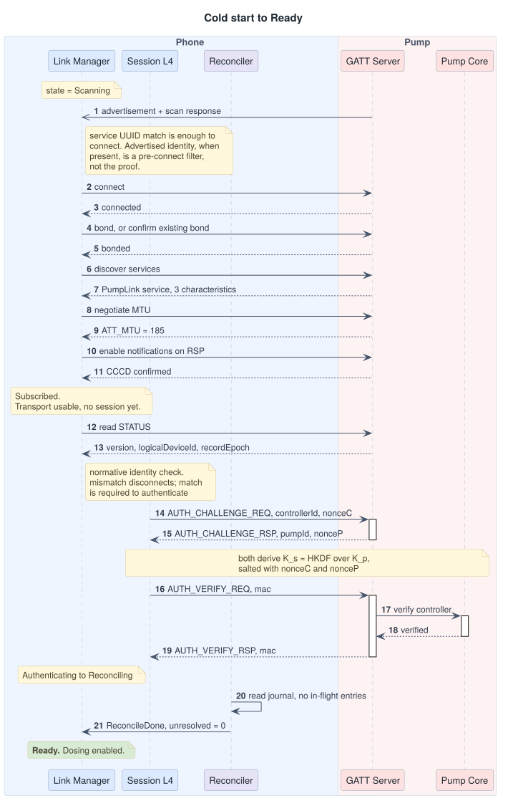
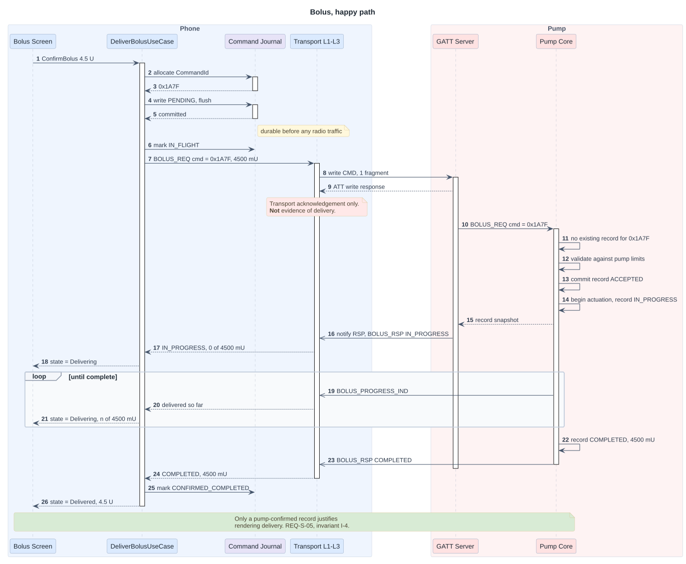
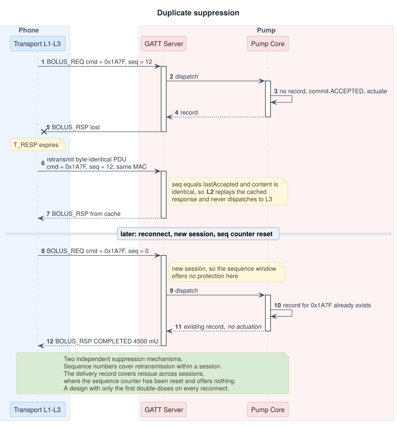
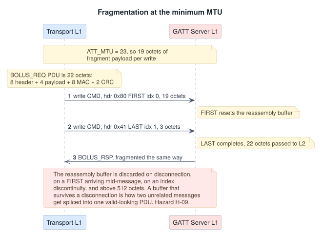

# 06 — Sequence Diagrams

Call flow between the app and the pump. Participants are grouped by process
boundary: everything in the blue box runs on the phone, everything in the red box
runs on the pump, and every arrow that crosses between them is a BLE operation
that can fail.

Steps are numbered so the [hazard analysis](04-hazard-analysis.md) and the test
suite can cite them.

## 1. Cold start to `Ready`

<picture>
  <source media="(prefers-color-scheme: dark)" srcset="img/06-cold-start-dark.svg">
  
</picture>

Steps 15 through 21 cannot be skipped, and steps 22 through 24 cannot be
skipped, because `Ready` is only reachable through them. That is the structural
enforcement described in
[03-connection-state-machine.md](03-connection-state-machine.md#reconciling-is-the-point-of-the-diagram).

## 2. Bolus, happy path

<picture>
  <source media="(prefers-color-scheme: dark)" srcset="img/06-happy-path-dark.svg">
  
</picture>

The two annotations carry the argument. Step 12 is the ATT write response, and it
is the thing a naive implementation treats as success. Step 21 is a pump-confirmed
record, and it is the only thing the app is permitted to render as delivery.
(REQ-S-05, invariant I-4)

## 3. Ambiguous outcome and recovery

The diagram this whole repository exists for.

<picture>
  <source media="(prefers-color-scheme: dark)" srcset="img/06-recovery-dark.svg">
  
</picture>

Three details worth stopping on.

**Step 11 is the correct interpretation of an exhausted retry budget.** Retries
ran out. The command did not fail — its outcome is unknown, and unknown is a
third state that most implementations do not have. Collapsing it into failure is
what causes under-dosing; collapsing it into success causes over-dosing.

**The `critical` block is not decoration.** It is a UML critical region because
reconciliation must complete before any other operation on this session, and the
`option` branches are its named failure handlers. The state machine makes this
structural: none of the four branches can be preceded by a bolus, because `Ready`
is downstream of all of them.

**The `NEVER_SEEN` branch reissues the same `CommandId`.** Allocating a fresh one
would be a new dose by definition and would defeat the pump's duplicate
suppression entirely. (REQ-S-08)

## 4. Duplicate suppression

What happens when the pump *did* receive the original and the controller retries
anyway. This is the mirror of diagram 3 and the reason reissue is safe.

<picture>
  <source media="(prefers-color-scheme: dark)" srcset="img/06-duplicate-suppression-dark.svg">
  
</picture>

The two suppression mechanisms cover different failures and neither is
redundant. Sequence-number suppression handles retransmission inside one
session and is content-addressed. Delivery-record suppression handles
reissue across sessions, where the sequence counter has been reset and offers
nothing. A design with only the first double-doses on every reconnect.

## 5. Fragmentation at the minimum MTU

Included because "we handle fragmentation" is the kind of claim that is usually
untested at the boundary.

<picture>
  <source media="(prefers-color-scheme: dark)" srcset="img/06-fragmentation-dark.svg">
  
</picture>

The reassembly buffer is discarded on disconnection, on a `FIRST` arriving
mid-message, on an index discontinuity, and on exceeding 512 octets. Each of
those is a scenario-table row with a JVM test, because a reassembly buffer that
survives a disconnection is how two unrelated messages get spliced into one
valid-looking PDU.
