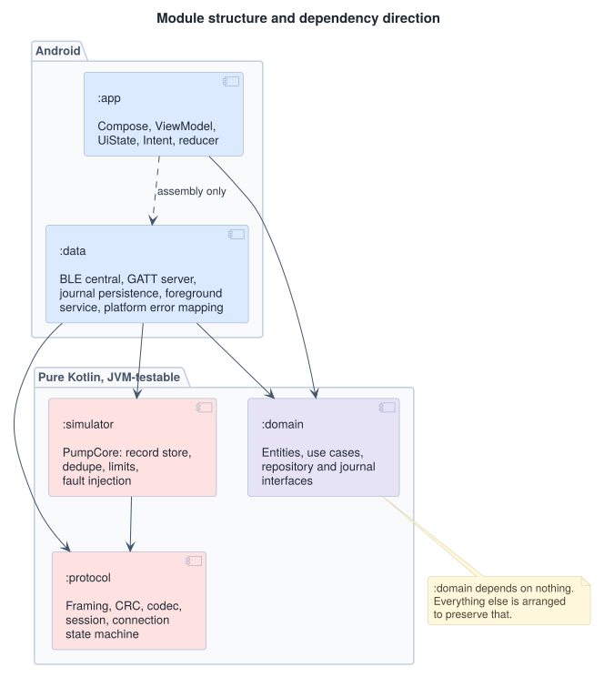

# 07 — Architecture

Recorded as decisions rather than as description, because the reasoning and the
rejected alternatives are the useful part. Each section gives context, the
decision, its consequences including the bad ones, and what would change it.

## Module structure

<picture>
  <source media="(prefers-color-scheme: dark)" srcset="img/07-modules-dark.svg">
  
</picture>

Arrows are compile-time dependencies. `:domain` depends on nothing, which is the
property that matters — everything else is arranged to preserve it.
`:presentation` depends only on `:domain`: the MVI types and the
connection-state projection live there so detekt's sealed-`when` rule can
actually see them. `:app` is a Compose shell over that module.

## ADR-01 — Clean architecture, with `:domain` independent of `:protocol`

**Context.** The obvious layering would let `:domain` import `:protocol`, since
both are pure Kotlin and the domain plainly needs to reason about command
outcomes and link state. It would remove a mapping layer and a set of enums that
look duplicated.

**Decision.** `:domain` depends on nothing. `:data` maps protocol types to domain
types at the boundary.

**Consequences.** There are two enums that look like the same enum. `:protocol`
has `CommandOutcome` — a wire concept, with a byte encoding, versioned with the
protocol. `:domain` has `Resolution` — a business concept describing what the app
now knows about a dose.

They are genuinely different despite the overlap, and the case that proves it is
`EVICTED`. On the wire that is one specific value meaning "no record, outside
retention." In the domain it collapses into the same `Indeterminate` as a
`T_RESOLVE` expiry, because the business consequence is identical: block dosing,
require human verification. The domain does not want the protocol's resolution,
and if it imported the protocol's enum it would be forced to carry a distinction
it has no use for, and to change every time the wire format gained a case.

The cost is real: a mapping function to maintain, and a reviewer's first reaction
is that it is ceremony. The benefit is that the protocol can version — new
opcodes, new outcomes, a v2 frame layout — without touching business logic, and
that the layer an iOS port would share is the one with no wire format in it.

**What would change this.** If the protocol were stable and owned by the same
team forever, and the mapping stayed one-to-one across a couple of versions, the
indirection would be costing more than it returns. It is not stable here; it is
the thing under active design.

## ADR-02 — MVI in the UI layer

**Context.** Google's guidance describes unidirectional data flow across UI,
domain, and data layers without endorsing "MVVM" or "MVI" by name. In practice
the industry converged: a single immutable state object exposed as `StateFlow`,
events up, state down. What is still a real choice is whether to formalize
intents into a sealed type routed through one entry point.

For an ordinary CRUD screen, formalizing intents is over-engineering and a good
reviewer knows it.

**Decision.** Full MVI here, deliberately, for a reason specific to this system.

```kotlin
sealed interface BolusIntent {
    data class DoseEntered(val milliunits: Int) : BolusIntent
    data object Confirmed : BolusIntent
    data object Cancelled : BolusIntent
    data class Acknowledged(val commandId: DomainCommandId) : BolusIntent
    data object ReissueConfirmed : BolusIntent
    data object ReissueDeclined : BolusIntent
    data object PumpVerifiedByUser : BolusIntent
    data object RecheckRequested : BolusIntent
}

sealed interface BolusUiState {
    data class Entering(val draft: Draft, val pump: PumpSummary) : BolusUiState
    data class Confirming(val dose: Dose, val pump: PumpSummary) : BolusUiState
    data class Delivering(val delivered: Dose, val requested: Dose, val commandId: DomainCommandId) : BolusUiState
    data class Delivered(
        val delivered: Dose,
        val commandId: DomainCommandId,
        val recovered: Boolean = false,
    ) : BolusUiState
    data class PartiallyDelivered(
        val delivered: Dose,
        val reason: AbortReason,
        val commandId: DomainCommandId,
        val recovered: Boolean = false,
    ) : BolusUiState
    data class AwaitingReissue(val dose: Dose, val elapsed: Duration, val commandId: DomainCommandId) : BolusUiState
    data class Resolving(val dose: Dose, val commandId: DomainCommandId) : BolusUiState
    data class Blocked(val dose: Dose, val commandId: DomainCommandId?) : BolusUiState
    data class Indeterminate(val dose: Dose, val commandId: DomainCommandId) : BolusUiState
    data class DosingDisabled(val link: LinkStatus) : BolusUiState
}

/** Local, ephemeral UI position. See ADR-07. */
data class Stage(
    val step: Step = Step.Editing,
    val acknowledged: DomainCommandId? = null,
)

enum class Step { Editing, Confirming }

fun reduce(stage: Stage, intent: BolusIntent): Stage
```

Every state that names a single command carries its `CommandId`. That is not
decoration: `Acknowledged` has to identify what it is retiring, and a result
arriving while a card is open must not be dismissible by a tap aimed at the
previous one.

These types live in `:presentation`, a pure JVM module. They do not live in
`:app`. detekt 1.23.8 only creates type-resolution tasks for plain JVM modules,
so `ElseCaseInsteadOfExhaustiveWhen` cannot run under AGP 9. Putting the
reducer in `:app` would make ADR-02 a convention again. Putting it in
`:presentation` makes the convention a build failure.

**Why it earns its cost here.** Every transition is a pure function testable
without a radio, and the compiler refuses to build a reducer that adds a state or
an intent and leaves a combination unhandled.

That is the difference between a style preference and a risk control. Each hazard
in [04-hazard-analysis.md](04-hazard-analysis.md) corresponds to a specific
`(state, intent)` pair, and each pair has a test. When `Indeterminate` was added
to handle H-04, the build broke in every place that had not decided what to do
when the app does not know whether insulin was delivered. A compile error is the
correct failure mode for that omission. A runtime `else` branch quietly rendering
a spinner is not.

This is requirements traceability expressed in the type system, and it is the
single strongest reason to choose MVI for this screen and not for most screens.

**Consequences.** More types and more boilerplate than a `ViewModel` with a few
`StateFlow`s. Ten UI states for one screen looks excessive until you notice that
five of them are the terminal states from
[01-feature-flow.md](01-feature-flow.md#terminal-states) and two of those block
dosing.

The rule that makes it work: **never add `else` to a `when` over a sealed type in
this codebase.** A missing branch is the compiler doing its job. This is stated
in `.cursor/rules/architecture.mdc` as well, because it is exactly the kind of
thing a code assistant will helpfully "fix."

**What would change this.** A screen where states are independent rather than
mutually exclusive — a settings page, a list with filters — is better served by a
single state object without a formal intent hierarchy. MVI is not the house
style; it is the choice for this screen.

## ADR-03 — One-off events are modeled as state

**Context.** The established pattern for "show a snackbar" or "navigate away" has
been a `Channel` or `SharedFlow` of one-shot effects, often behind an `Event`
wrapper.

**Decision.** No `Channel`, no `SharedFlow`, no `Event` wrapper for
ViewModel-to-UI communication. Everything is `UiState`.

Google's current guidance says
[ViewModel events should always result in a UI state update](https://developer.android.com/topic/architecture/ui-layer/events),
and the recommendations table lists "do not send events from the ViewModel to the
UI" as strongly recommended, because when the producer outlives the consumer
those APIs do not guarantee delivery.

**Why it is not a close call here.** The general argument is that an event may be
dropped if the UI is backgrounded at the wrong moment. In this app the dropped
event would be *"we do not know whether 4.5 units were delivered."*

There is no fire-and-forget notification in an insulin delivery application. If
the pump's state is unknown, that is a property of the system that persists until
someone resolves it, and it must survive backgrounding, rotation, and process
death. It is state by nature; representing it as an event was always a category
error, and the platform guidance simply happens to agree.

**Consequences.** Transient messages need an explicit acknowledgement intent to
clear them, which is more code than firing and forgetting. For states that block
dosing, that is not a drawback — being unable to dismiss the indeterminate state
without resolving it is the point.

## ADR-04 — Two state machines, kept separate

**Context.** There is a connection state machine in `:protocol` and a UI state
hierarchy in `:presentation`. They are correlated. Merging them removes an
apparent duplication.

**Decision.** They stay separate. `BolusUiState` is a **projection**:

```kotlin
fun project(
    link: LinkStatus,
    journal: JournalSnapshot,
    pump: PumpSummary?,
    draft: Draft?,
    stage: Stage = Stage(),
    resolving: DomainCommandId? = null,
): BolusUiState
```

Pure, in `:presentation`, tested by feeding it combinations and asserting the
result. `:domain` owns `LinkStatus` (a coarse, protocol-free view of the link);
`:data` maps `:protocol` `LinkState` onto it. `:presentation` never imports
`:protocol`.

**Why.** The two have different alphabets, in both directions.

`LinkState` distinguishes `Connecting`, `Bonding`, `Discovering`, and
`Configuring`; the UI renders one spinner for all four, and should, because the
user cannot act differently on any of them. Conversely `BolusUiState` has
`Entering` and `Confirming`, which the transport has no business knowing exist.

Merging them produces the standard BLE application failure: a UI state enum that
grows a case every time the transport learns a new failure mode, and a transport
that cannot be tested without instantiating a UI. Once that has happened, the
protocol layer cannot be ported, reused, or fuzzed independently, which forfeits
most of the value of having written it carefully.

**Consequences.** A projection function to maintain, and one more place to look
when tracing why the screen shows what it shows. In exchange, the projection is
where the interesting logic concentrates and it is exhaustively table-testable —
`Ready` plus an unresolved journal entry must never project to a state with an
enabled dose button, and that is one assertion rather than an audit of the UI.

## ADR-05 — Kotlin Multiplatform considered and not adopted

**Context.** `:protocol`, `:domain`, `:presentation`, and `:simulator` are
pure Kotlin with no Android dependencies. Converting them to KMP targets would
let an iOS app consume the identical framing, session, state machine, and
business logic, which is the strongest possible answer to the parity problem in
[05-parity-contract.md](05-parity-contract.md).

**Decision.** Structure for it. Do not build it.

The modules are already free of Android imports and would move to
`kotlin("multiplatform")` with a source-set reshuffle and no logic changes. That
is a deliberate property, maintained by the module boundaries and enforced by the
build.

**Why not build it.** It would consume the majority of the time available and
demonstrate KMP toolchain configuration, which is not the skill this project
exists to show. Worse, it would weaken the parity document: if the protocol layer
is literally shared, the ten platform divergences that make parity hard do not
disappear — they move into the thin platform layer where they are easier to
overlook. The divergences are in bonding order, notification enablement, device
identity, advertising payload, and background execution, and no amount of
shared Kotlin removes them.

Sharing the protocol layer is a real answer to part of the problem. Believing it
is the whole answer is the trap.

**What would change this.** A second platform actually being built, and a team
willing to own the KMP toolchain in a regulated build and release process —
which is a change-control question at least as much as a technical one.

## Where the safety argument lives

| Hazard | Enforced in | Android needed to test? |
| --- | --- | --- |
| H-01, H-04, H-13 | `:simulator` record store and limits | No |
| H-02, H-03, H-07, H-14 | `:domain` use cases, `:presentation` projection | No |
| H-06, H-08, H-09, H-10 | `:protocol` codec and session | No |
| H-05, H-11 | `:protocol` state machine, `:data` platform mapping | Partly |
| H-12 | `:data` journal and foreground service | Yes |

Twelve of fourteen hazards have their controls in pure Kotlin and are verified in
CI on every push, in seconds, with no device attached. That is the practical
payoff of the module boundaries, and it is the argument to make when someone
proposes collapsing them.

## ADR-06 — The safety journal is an append-only file with `fsync`, not Room

**Context.** The obvious store for a command journal on Android is Room. It is
typed, migratable, and already in every Android codebase. The journal exists
to survive process death between "I am about to transmit `CommandId` N" and
"I know what happened to N" (REQ-S-02, hazard H-12). That is a durability
requirement, not a query requirement.

Room's default SQLite connection uses `synchronous=NORMAL`. A `COMMIT` returns
when the rollback journal is written, not when the WAL and the database file
have hit stable storage. A power loss or a kernel kill in that window can
leave the journal without the row the safety argument depends on. SQLite can
be opened at `synchronous=FULL`, but that is not Room's default, it is easy
to lose on a connection-pool change, and it is still a B-tree with a WAL
whose recovery semantics are more than the journal needs.

**Decision.** The journal is an append-only file. Each entry is a length-
prefixed record. After every append the implementation calls `FileDescriptor.sync()`
(`fsync`) and does not return success until that call returns. There is no
in-place update: a state change is a new record for the same `CommandId`, and
the reader takes the latest. Rotation is out of scope for the lifetime of
this project.

**Consequences.** No SQL, no migrations, no Room dependency in `:data`. The
file is auditable with `hexdump`. The durability guarantee is one syscall,
named, rather than a PRAGMA buried in a helper. The cost is that we do not
get Room's query API or its test fakes; the journal is small and is always
read in full.

**What would change this.** A journal that must be queried by something other
than "give me the latest record per `CommandId`," or a storage layer already
configured at `synchronous=FULL` and covered by a durability test that pulls
power. Neither is true here.

## ADR-07 — Ephemeral UI position is separated from derived truth

**Context.** `BolusUiState` is a projection (ADR-04), but not everything on the
screen can be derived from the journal. "The operator is looking at a
confirmation prompt" and "the operator has dismissed a result card" are facts
about the UI, not about the pump. An early implementation had `reduce` folding
`BolusUiState` directly while the ViewModel built its state purely from
`project`, so the reducer was unreachable: `Confirming` was never produced, and
the confirmation step did not exist at runtime.

**Decision.** Two functions with different jobs, composed in that order.

`project` owns everything safety-relevant and is derived from the journal, the
link, and the pump. `reduce` owns a small `Stage` — a dose-entry `step` and
an optional dismissed `acknowledged` CommandId — and nothing else. `Stage` is
consulted **only** when the projection has already concluded that the screen
is at `Entering` or at a settled result. Every hazard state ignores it.

The consequence worth stating plainly: no sequence of intents can produce a UI
that claims a delivery outcome the pump did not report, because `reduce` has no
access to the journal and cannot construct a `BolusUiState` at all.

**Where an acknowledgement lives is a safety question.** The split is on
survivability, not convenience:

| Retiring | Held in | Survives process death | Why |
| --- | --- | --- | --- |
| A successful or partial result | `Stage.acknowledged` | No | Re-showing a delivered dose after a restart is harmless |
| An `Indeterminate` outcome | `JournalState.Acknowledged` | Yes | A hazard that a restart could clear is not a control |
| A declined reissue | `JournalState.Acknowledged` | Yes | "Do not deliver" is a decision, and re-prompting invites a second answer |

ADR-03 already required that transient messages need an explicit
acknowledgement intent to clear them. `BolusIntent.Acknowledged` is that intent;
this ADR only decides where each kind of acknowledgement is stored.

**Consequences.** One more concept than a single reducer, and a projection whose
signature now carries `stage` and `resolving`. In exchange the reducer is live,
tested code rather than decoration, and the durability of a hazard
acknowledgement is a type-level property rather than a habit.

### Correction: the journal fold

ADR-06 states that "a state change is a new record for the same `CommandId`, and
the reader takes the latest." The reader did not take the latest.
`JournalSnapshot` filtered the whole log, so the `Pending` and `InFlight` records
that `DeliverBolusUseCase` writes before transmission kept matching after the
command resolved. One bolus pinned the screen to `Delivering` permanently, and a
single `Indeterminate` record latched that state forever, which is also why the
"I checked the pump" action could not clear it.

`JournalSnapshot.current()` now folds the log to the latest record per
`CommandId`, and `inFlight`, `indeterminate`, `awaitingReissue`, and
`lastTerminal` all read the fold. This is a code fix, not a spec change — ADR-06
already specified the intended behaviour.

### Correction: dismissal and step are independent

The original `Stage` was a single sealed value: `Editing`, `Confirming`, or
`AckedDelivery(commandId)`. Acknowledging a result therefore *was* the stage,
so the next intent that moved the step — `Confirmed` to review a new dose,
`DoseEntered` to edit — discarded the dismissal. The Delivered card returned
and the operator could not dose again.

`Stage` is now two fields. `step` is the dose-entry position. `acknowledged`
is the CommandId whose result card has been dismissed. Only
`BolusIntent.Acknowledged` writes `acknowledged`. Every other intent writes
only `step`. The two facts no longer overwrite each other.

## ADR-08 — The operator surface and the diagnostic surface are separate

**Context.** The first Compose shell put protocol internals on the dosing
screen: `cmd 0x0002`, `store 0x…`, `awaiting BOLUS_RSP`, "journaled before
it is transmitted." That is the right information for a reviewer tracing a
session. It is the wrong information for the person who has to decide
whether to press Deliver. A surface that mixes both audiences makes the
critical task harder to read, and it hides that the author knows the
difference.

**Decision.** Two surfaces, one projection.

The **operator surface** — the dosing card and the pinned action bar — is
plain language. The card answers *what is happening*. The bar answers
*what you can do*, always in the same place. Protocol identifiers, MTU,
store instance, and opcode names do not appear there.

The **diagnostic surface** is the existing link panel. It already existed
to make "Linking" diagnosable. It now also carries the store instance and
the most recent CommandId, which is where a reviewer looks when they want
the wire.

`actions(state: BolusUiState): List<BolusAction>` is a total function in
`:presentation`. A new UI state that forgets to name its actions is a
compile error, and the bar can be tested without Compose. `Delivering`
and `Resolving` return an empty list; the bar then shows a status strip
so emptiness never reads as a broken control. `DosingDisabled` returns
`OpenLinkPanel`, so "open the link panel" is an action rather than a
caption on a dead end.

**Deferred, and named so they stay deferred rather than forgotten.**

- Accessibility: TalkBack semantics, live regions on state change, a
  merged dose readout, 48 dp targets on the preset chips, and a layout
  that survives 200% font scale.
- Critical-action slip resistance: Cancel and Deliver remain adjacent
  and equal-weight. A later pass should separate them.

**What would change this.** A reviewer who is also the only operator, and
a decision that the demo is the protocol rather than the task. That is a
different product.

## ADR-09 — Recovery is journaled, and every UI state has a named scenario

**Context.** A dropped `BOLUS_RSP` is not a failed delivery. The controller
asks the pump and usually learns `COMPLETED`. The screen then showed the
same Delivered card as the happy path, so a working query-then-decide
looked like a successful first try. `prepare()` already writes Pending
and InFlight on every send, so recovery cannot be inferred from those
rows. Meanwhile, several `BolusUiState` values are hard to reach over the
radio, which made the operator surface unreviewable except by fault
injection that itself had holes.

**Decision.** Two durable facts, one shared table.

Before any post-failure query, the controller appends
`JournalState.Resolving`. That is independently correct: a process death
mid-query must say "we were asking", not "we transmitted and are waiting".
`JournalSnapshot.wasRecovered(commandId)` is then true for the life of
that CommandId, and `BolusUiState.Delivered` / `PartiallyDelivered` /
`HistoryRow` carry a `recovered` flag so the operator card can say so.

`BolusScenarios` in `:presentation` main is a named table of projection
inputs plus the expected `BolusUiState` subclass. A JVM test asserts
each row, and `classify()` is a total `when` so a new state that has no
scenario will not compile. The debug-only `StateGalleryActivity` renders
the same table through the real `BolusScreen`. Production code is not
involved.

**Consequences.** The journal grows by one row on every ambiguous
response. That is cheap and the reason the log is append-only. The
gallery is `app/src/debug/` only; a release build does not contain it.

**What would change this.** A protocol-level "this reply is a recovery"
flag, which would duplicate what the journal already knows, or a product
decision that recovered and first-try deliveries should look identical.

## ADR-10 — `PumpRepository` in `:domain`, session in the service

**Context.** The module diagram already named repository interfaces in `:domain`
and marked `:app` → `:data` as assembly only. The ViewModel still constructed
`FileJournal`, `PersistentCommandIds`, and `BleController` on `viewModelScope`,
and `PumpLinkService` was declared but never started.

**Decision.** `PumpRepository` is a port in `:domain`. `BleController`
implements it. `PumpSession` sits in front for start/stop policy: Stop is
refused while the journal is in flight. `PumpLinkApp` is the composition root
(journal, ids, controller) because `startService` is asynchronous in-process
and the ViewModel needs a port on first frame. `PumpLinkService` owns
keep-alive and teardown: it observes `sessionRequested` and the journal,
promotes to `connectedDevice` foreground when
`SessionKeepAlive.shouldBeForeground` is true, and stays `START_STICKY`.

The process graph is Hilt (ADR-11). Lifetime — who starts the service, when
it is foreground — is still this ADR.

**H-12 versus the shipping hold.** H-12 requires the process to be held at
least while a command is in flight. Android 8+ kills a background started
service in about a minute, so a shipping controller also holds foreground for
the whole requested session (`start` until `stop`). That is stricter, not a
rewrite of the hazard. `stop()` while in flight is ignored.

**Consequences.** The ViewModel has no `dev.pumplink.data` imports. Leaving
the dosing screen no longer cancels an in-flight coroutine. The cost is an
Application class, a session decorator, and a service that must call
`startForeground` within the platform timeout when started via
`startForegroundService` (process relaunch with in-flight rows).

**What would change this.** A second client of the session (a wear companion,
a backup activity) that made a bound AIDL API earn its keep, or a product
decision that idle GATT may die when the user hits Home.

## ADR-11 — Hilt is the composition root

**Context.** ADR-10 assembled `FileJournal`, `PersistentCommandIds`,
`BleController`, and `PumpSession` in `PumpLinkApp`, and passed the port
through a `ViewModelProvider.Factory` and a `SessionOwner` cast. That was
enough to prove the lifetime split. It is not how this codebase would be
wired on a team that already uses Hilt.

**Decision.** Hilt owns the `SingletonComponent`. `:data` provides the
journal, command ids, session `CoroutineScope`, and `BleController`, and
binds `PumpRepository` to `PumpSession`. `@HiltAndroidApp`,
`@AndroidEntryPoint`, and `@HiltViewModel` replace the factory and the
Application cast. `PumpLinkApp.onCreate` still starts the service and
calls `holdForInFlightJournal()` — that is lifetime, not a missing binding.

`:domain` and `:presentation` do not depend on Hilt. ViewModel unit tests
still construct `BolusViewModel(FakePumpRepository())`.

**Consequences.** Two Gradle plugins (`hilt`, `ksp`) on `:app` and `:data`.
Kotlin 2.4 metadata may require pinning `kotlin-metadata-jvm` on the KSP
classpath until Hilt ships a compiler that accepts it. The graph is now
reviewable as a module rather than as `Application` lines.

**What would change this.** A decision to keep the process graph as explicit
constructors because the app has one session and will never grow another
client.

## Conventions

- Kotlin, coroutines, Gradle Kotlin DSL, version catalog
- `compileSdk 37`, `targetSdk 37`, `minSdk 31` — `compileSdk` is 37 because
  AndroidX 1.19 requires it; `targetSdk` matches it. Hardware verification is
  API 33. Rationale in
  [00-overview.md](00-overview.md#verification-boundary)
- ViewModel depends on `PumpRepository` only; Hilt modules live in `:data`
- ViewModel exposes `StateFlow` via `stateIn(WhileSubscribed(5_000))`
- Compose collects with `collectAsStateWithLifecycle()`
- Composables take `(uiState, onIntent)` and hold no ViewModel reference, so
  every state including the ones that are hard to reach is previewable
- No `else` branches on `when` over sealed types
- `:protocol`, `:domain`, `:presentation`, and `:simulator` have no Android
  dependencies, checked by the build rather than by review
